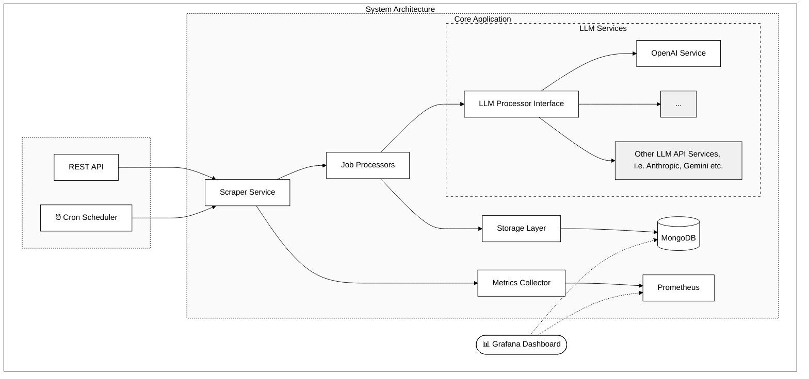

# Job Scraper - Go Application

[](https://golang.org/doc/devel/release.html)
[](https://www.gnu.org/licenses/gpl-3.0)

A scalable job scraping application written in Go that collects, processes, and analyzes job postings from various sources. 
The application uses by default the OpenAI ChatGPT API (or any other LLM Service that has API support) for intelligent data extraction and provides comprehensive analytics through Prometheus and Grafana.

<details>
<summary><strong>Table of Contents</strong></summary>

- [Job Scraper - Go Application](#job-scraper---go-application)
  - [Features](#features)
    - [Core Features](#core-features)
  - [Architecture](#architecture)
  - [Initial Setup and Configuration](#initial-setup-and-configuration)
    - [Prerequisites](#prerequisites)
    - [Environment Setup](#environment-setup)
    - [Deployment Options](#deployment-options)
      - [Local Development](#local-development)
      - [Docker Deployment](#docker-deployment)
      - [Kubernetes Deployment](#kubernetes-deployment)
      - [Service Access](#service-access)
    - [Verification](#verification)
  - [Usage](#usage)
    - [API Endpoints](#api-endpoints)
      - [Scraping Operations](#scraping-operations)
      - [Data Access](#data-access)
  - [Monitoring \& Observability](#monitoring--observability)
    - [Prometheus Metrics](#prometheus-metrics)
      - [API Metrics](#api-metrics)
      - [Scraper Metrics](#scraper-metrics)
      - [Processor Metrics](#processor-metrics)
      - [Storage Metrics](#storage-metrics)
    - [Prometheus Configuration](#prometheus-configuration)
    - [Grafana Setup and Usage](#grafana-setup-and-usage)
      - [Initial Access](#initial-access)
      - [Setting up the Grafana API Key to Set Up the Data Sources](#setting-up-the-grafana-api-key-to-set-up-the-data-sources)
      - [Automated Setup using Scripts](#automated-setup-using-scripts)
      - [Importing the Dashboard](#importing-the-dashboard)
      - [Additional Data Sources (Optional)](#additional-data-sources-optional)
      - [Dashboard Maintenance](#dashboard-maintenance)
      - [Creating Custom Dashboards (Prometheus Example)](#creating-custom-dashboards-prometheus-example)
    - [Troubleshooting](#troubleshooting)
  - [Extending the Application](#extending-the-application)
    - [Adding a New Scraper](#adding-a-new-scraper)
    - [Adding New Metrics](#adding-new-metrics)
    - [Adding New API Endpoints](#adding-new-api-endpoints)
  - [Testing](#testing)
    - [Running Tests](#running-tests)
    - [Code Style Guidelines](#code-style-guidelines)
  - [License](#license)
</details>

## Features

### Core Features
- Modular scraper architecture extensible for multiple job portals
- Intelligent job data extraction using ChatGPT
- MongoDB persistence layer
- RESTful API for data access and control
- Comprehensive metrics and monitoring
- Kubernetes-ready deployment
- Scheduled scraping with configurable intervals

## Architecture



The application follows a modular, layered architecture:
- **API Layer**: HTTP endpoints for control and data access
- **Service Layer**: Business logic and orchestration
- **Processor Layer**: Data processing and enrichment
- **Storage Layer**: Data persistence and retrieval
- **Metrics Layer**: Performance and operational metrics

## Initial Setup and Configuration

### Prerequisites
- Go 1.23+
- Docker and Docker Compose
- MongoDB 6.0+
- OpenAI API key
- Kubernetes (for production deployment)

### Environment Setup

1. Clone the repository:
```bash
git clone https://github.com/src-dbgr/go-job-scraper.git
cd go-job-scraper
```

2. Configure environment variables:
```bash
# Copy example environment file
cp .env.example .env
```

3. Set required environment variables in `.env`:
```bash
# Core Settings
MONGODB_URI=mongodb://mongodb:27017
MONGODB_DATABASE=jobsdb
OPENAI_API_KEY=your_openai_api_key
OPENAI_API_URL=https://api.openai.com/v1/chat/completions

# Monitoring Settings
PROMETHEUS_PORT=2112
GRAFANA_ADMIN_PASSWORD=your_grafana_password

# Optional Settings
API_PORT=8080                     # Default: 8080
SCRAPING_INTERVAL="0 */6 * * *"  # Default: every 6 hours
LOG_LEVEL=info                    # Default: info
```

4. Configure application settings in `config.yaml`:
```yaml
api:
  port: ${API_PORT}
  rate_limit: 100    # requests per minute
  timeout: 30s       # global request timeout

mongodb:
  uri: ${MONGODB_URI}
  database: ${MONGODB_DATABASE}
  max_connections: 100
  timeout: 10s

scrapers:
  jobsch:
    base_url: https://api.jobs.ch/v1
    schedule: ${SCRAPING_INTERVAL}
    default_pages: 5
    timeout: 15s
```

### Deployment Options

#### Local Development
1. Install dependencies:
```bash
make deps
```

2. Start required services:
```bash
docker-compose up -d mongodb prometheus grafana
```

3. Build and run the application:
```bash
make build
./dist/job-scraper
```

#### Docker Deployment
Start the complete application stack:
```bash
docker-compose up -d
```

This includes:
- Job Scraper application
- MongoDB database
- Prometheus monitoring
- Grafana dashboards

#### Kubernetes Deployment
1. Update Kubernetes manifests with your configuration:
```bash
# Review and modify deployments/kubernetes/* files
# Update image tags, environment variables, and resource limits as needed
```

2. Deploy to your cluster:
```bash
kubectl apply -f deployments/kubernetes/
```

3. Verify the deployment:
```bash
kubectl get pods
kubectl get services
```

#### Service Access
After successful deployment, access services at:
- Job Scraper API: http://localhost:8080
- Prometheus: http://localhost:9090
- Grafana: http://localhost:3000
- MongoDB: localhost:27017

### Verification
Verify the setup with:
```bash
# Check service health
curl http://localhost:8080/health

# Verify metrics endpoint
curl http://localhost:2112/metrics

# Test API access
curl http://localhost:8080/api/v1/scrapers/status
```

## Usage

### API Endpoints

#### Scraping Operations
```bash
# Start a scraping job
curl -X POST http://localhost:8080/api/v1/scrape/jobsch

# Check scraper status
curl http://localhost:8080/api/v1/scrapers/status
```

#### Data Access
```bash
# Get all jobs
curl http://localhost:8080/api/v1/jobs

# Get job statistics
curl http://localhost:8080/api/v1/stats/job-categories-counts
```

## Monitoring & Observability

### Prometheus Metrics

The application exposes metrics at `:2112/metrics`. Here are the key metric categories:

#### API Metrics
```go
HTTPRequestDuration // Duration of HTTP requests
HTTPRequestsTotal   // Total number of HTTP requests
ActiveRequests      // Number of currently active requests
```

#### Scraper Metrics
```go
ScrapingDuration    // Duration of scraping operations
ScrapedJobsTotal    // Total number of scraped jobs
ScraperErrors       // Total number of scraper errors
```

#### Processor Metrics
```go
ProcessorDuration   // Duration of processing operations
ProcessorErrors     // Total number of processor errors
OpenAITokensUsed    // Total number of OpenAI tokens used
```

#### Storage Metrics
```go
DBOperationDuration // Duration of database operations
DBOperationsTotal   // Total number of database operations
DBConnectionsActive // Number of active database connections
```

### Prometheus Configuration

The application uses the following Prometheus config (prometheus.yml):
```yaml
global:
  scrape_interval: 15s

scrape_configs:
  - job_name: 'job-scraper'
    static_configs:
      - targets: ['host.docker.internal:2112']
```

### Grafana Setup and Usage

#### Initial Access
1. Access Grafana at http://localhost:3000
2. Login with default credentials:
   - Username: `admin`
   - Password: Value from `GRAFANA_ADMIN_PASSWORD` in your `.env`

#### Setting up the Grafana API Key to Set Up the Data Sources
Before using the automation scripts, you need to create a Grafana API key:

1. Go to Configuration > API Keys
2. Click "Add API key"
3. Name: `job-scraper-admin`
4. Role: `Admin`
5. Click "Add"
6. **Important**: Save the generated API key securely, you will need it for the datasource setup script

#### Automated Setup using Scripts

The project includes an automation script to set up all required datasources:

```bash
# Make the script executable
chmod +x scripts/manage_grafana_v1_datasources.sh

# Run the script (you will be prompted for your Grafana API key)
./scripts/manage_grafana_v1_datasources.sh
```

This script will create all necessary datasources including:
- Jobs endpoint
- Job category statistics
- Salary statistics
- Various job market analytics endpoints

#### Importing the Dashboard

The project includes a pre-configured dashboard for job scraping analytics:

1. Go to Dashboards > Import
2. Click "Upload JSON file"
3. Select `configs/dashboards/job_scaper_dashboard.json`
4. Click "Import"

The dashboard includes:
- Job scraping overview
- Category distribution
- Geographical insights
- Salary trends
- Processing metrics

#### Additional Data Sources (Optional)

While the main dashboard uses the JSON API datasources, you can optionally add Prometheus as an additional data source for system metrics:

1. Go to Configuration > Data Sources
2. Add Prometheus
3. URL: `http://prometheus:9090`
4. Click "Save & Test"

This allows monitoring of system-level metrics like scraping performance and API response times alongside the job market analytics.

#### Dashboard Maintenance

Check the dashboard's health:
1. Verify all panels are loading data correctly
2. Check API endpoint connectivity
3. Review any error messages in panel queries
4. Update time ranges for relevant insights

If you need to reset or recreate the datasources, you can use the script with the delete option:
```bash
./scripts/manage_grafana_v1_datasources.sh
# Choose option 2 when prompted to delete all datasources
```

#### Creating Custom Dashboards (Prometheus Example)

Example PromQL queries for custom dashboards:

1. Scraping Success Rate:
```promql
rate(jobscraper_scraper_jobs_total{status="success"}[5m])
```

2. Average Processing Time:
```promql
rate(jobscraper_processor_operation_duration_seconds_sum[5m])
/
rate(jobscraper_processor_operation_duration_seconds_count[5m])
```

3. Error Rate by Scraper:
```promql
rate(jobscraper_scraper_errors_total[5m])
```

### Troubleshooting

Common issues and solutions:

1. Metrics not showing up:
   - Check if the application is exposing metrics on port 2112
   - Verify Prometheus target is reachable
   - Check for any firewall issues

2. Grafana connection issues:
   - Verify Prometheus data source configuration
   - Check network connectivity between containers
   - Validate authentication settings

3. Missing data points:
   - Check scrape interval configuration
   - Verify metric collection is active
   - Check for any rate limiting issues

## Extending the Application

### Adding a New Scraper

1. Create a new scraper package:
```go
// internal/scraper/newportal/newportal_scraper.go

package newportal

type NewPortalScraper struct {
    client     HTTPClient
    baseURL    string
    jobFetcher JobFetcher
}

func NewNewPortalScraper(config Config) *NewPortalScraper {
    return &NewPortalScraper{
        client:  &http.Client{},
        baseURL: config.BaseURL,
    }
}

func (s *NewPortalScraper) Scrape(ctx context.Context) ([]models.Job, error) {
    // Implement scraping logic
}
```

2. Register the scraper in the factory:
```go
// internal/scraper/factory.go

func NewScraper(name string, config map[string]string) (Scraper, error) {
    switch name {
    case "newportal":
        return newNewPortalScraper(config)
    // ...
    }
}
```

3. Add configuration:
```yaml
scrapers:
  newportal:
    base_url: https://api.newportal.com
    schedule: "0 */6 * * *"
```

### Adding New Metrics

1. Define metrics in a domain file:
```go
// internal/metrics/domains/newmetrics.go

var (
    NewMetric = promauto.NewCounter(
        prometheus.CounterOpts{
            Name: "jobscraper_new_metric_total",
            Help: "Description of the metric",
        },
    )
)
```

2. Implement collection logic in relevant components.

### Adding New API Endpoints

1. Create handler function:
```go
// internal/api/new_handler.go

func (a *API) handleNewEndpoint(w http.ResponseWriter, r *http.Request) {
    // Implement handler logic
}
```

2. Register route:
```go
// internal/api/api.go

func (a *API) setupRoutes() {
    v1Router.HandleFunc("/new/endpoint", a.handleNewEndpoint).Methods("GET")
}
```

## Testing

### Running Tests

```bash
# Run all tests
make test

# Run unit tests only
make test-unit

# Run integration tests
make test-integration

# Generate coverage report
make cover
```

### Code Style Guidelines

- Follow Go best practices and idioms
- Use meaningful variable and function names
- Write tests for new functionality
- Update documentation as needed
- Add appropriate logging and metrics

## License

This project is licensed under the GPL v3 License - see the [LICENSE](LICENSE) file for details.
